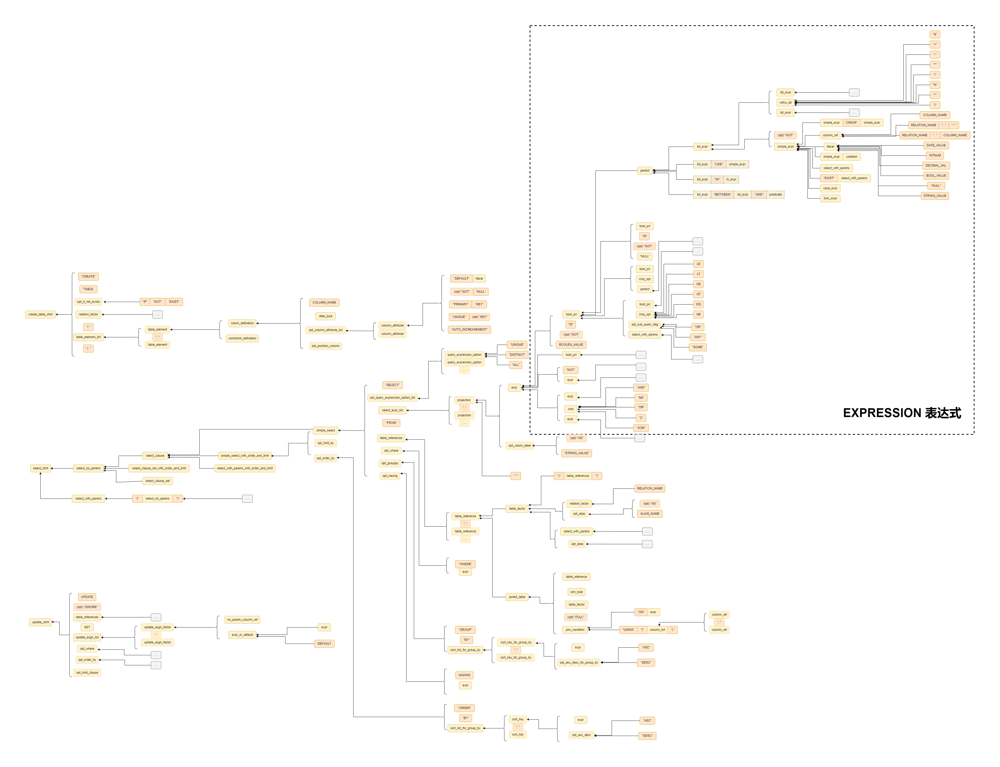
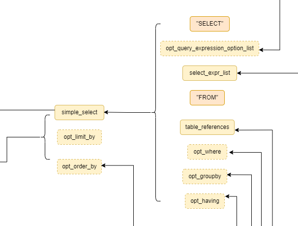
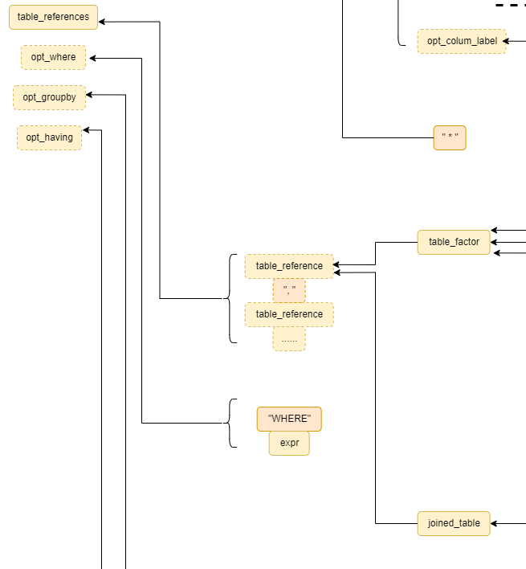
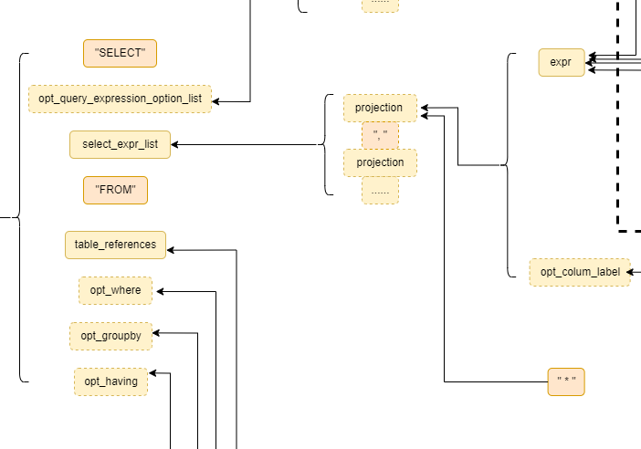
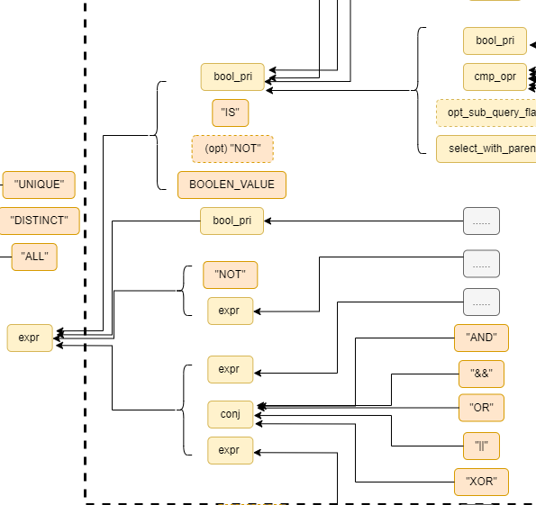

# OceanBase yacc文件分析

研究OceanBase的yacc文件可以帮助我们了解在一个成熟的数据库中SQL语句是如何被解析的。
这对于MiniOB的扩展开发非常有帮助，特别是在Expression解析方面。
Expression解析涉及到许多赛题，也非常麻烦。可以借鉴OceanBase来进行开发。

为了清晰地表示文法之间关系，我画了一张图，如下：

其中，黄色代表非终结符，橙色代表终结符，箭头表示可以推导出的文法规则。虚线边框表示该token是可有可无的。

这么大的图片看起来有点费劲，让我们拆开来分别进行讲解。

### 一、Select语句

Select语句由以下几个token组成

1. 终结符"SELECT"
2. (可选)查询选项
3. 表达式列表
4. 终结符"FROM"
5. 表引用
6. where
7. groupby
8. having

可以发现，select语句中的列实际上是“表达式”，因为select的对象不只有列，还可以是常量/函数/聚合函数等等。

### 二、Table

Table既可以由join构成，也可以只是表的名字

在Miniob中实现Join时，也可以采取这种思路

### 三、Field

Select的列实际上就是 表达式 + alias

select语句中的列实际上是“表达式”，毕竟select的对象不只有列

### 四、Expression

布尔值本身可以是一个表达式

表达式和表达式之间通过and/or连接后，组合成了一个新的表达式

“NOT + 表达式”的组合本身也是表达式 